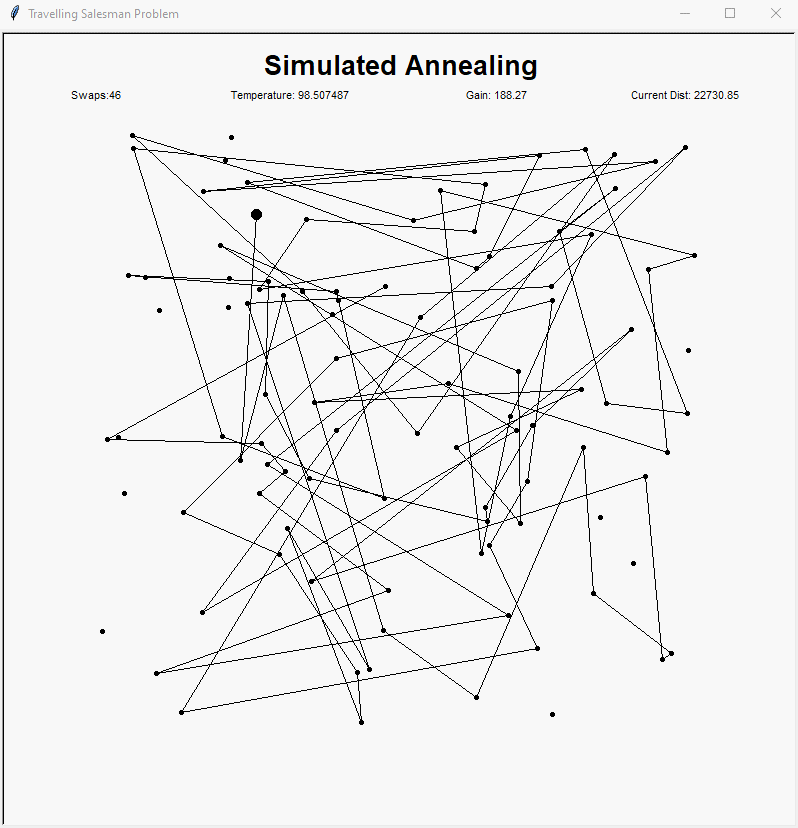

# travelling-salesman

Graphically visualizing various solving algorithms to the famous Travelling Salesman Problem with turtle.py

The travelling salesman problem asks the following question:
> "Given a list of cities and the distances between each pair of cities, what is the shortest possible route that visits each city exactly once and returns to the origin city?" ([Wikipedia](https://en.wikipedia.org/wiki/Travelling_salesman_problem))

Algorithms covered:
- Brute Force
- Greedy Search
- 2-Opt
- Simulated Annealing

